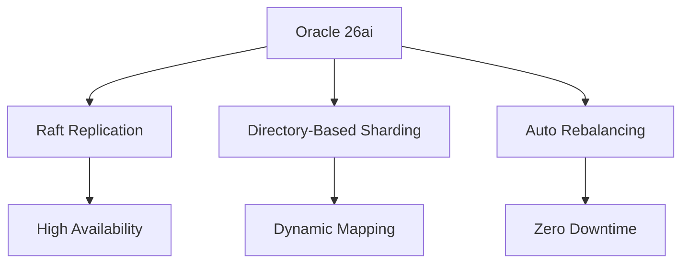

# Oracle AI DB 26aiの進化と、Spannerの設計から読み解くRDBMS進化論

RDBMS（リレーショナルデータベース管理システム）は、SQLとACIDトランザクションを基盤に、エンタープライズで長年採用されてきました。しかし、クラウド時代のスケーラビリティや分散処理の需要増に伴い、NewSQLの特性を取り込みつつあります。本記事では、Oracle AI Database 26aiのシャーディング強化、Google Cloud Spannerの設計思想、両者の類似点、MySQL/PostgreSQLの分散対応を解説し、RDBMSがNewSQLになりうるかを考察します。

## はじめに：RDBMSとNewSQLの境界の曖昧化

RDBMSは、SQL標準とACIDトランザクションを特徴とし、垂直スケーリングを前提に設計されています。一方、NewSQLはRDBMSのSQLとACIDを維持しつつ、NoSQLの水平スケーラビリティを融合したデータベースです。代表例として、Google Cloud Spannerはグローバル分散と強一貫性を実現し、CockroachDBやTiDBはマルチクラウド対応を重視します[^1][^2]。

Oracle AI Database 26aiの登場により、RDBMSはシャーディングやAI統合を強化し、NewSQLに近づいています。この境界の曖昧化は、クラウドネイティブやAIワークロードの需要によるものです。本記事では、Oracle 26aiとSpannerを中心に、RDBMSの進化を紐解きます。

## Oracle AI Database 26aiのシャーディング機構の進化

Oracle AI Database 26aiは、2025年10月にリリースされた長期サポート（LTS）版で、分散データ管理（Globally Distributed Database）を大幅に強化しました[^3][^4]。以下に、シャーディング関連の主な進化を解説します。

### 主な強化点
- **Raftレプリケーション**：従来のPaxosからRaftへ移行し、シャード間の同期を効率化します。データ損失なしの自動フェイルオーバーを実現し、99.999%の可用性を提供します[^5]。
- **Directory-Based分布**：`DBMS_SHARDING_DIRECTORY`パッケージにより、キー値とシャードの動的マッピングをランタイムで制御します。JDBC経由で柔軟なデータ配置が可能です[^6]。
- **自動再バランス**：`DBMS_AUTO_CLUSTERING`でシャードを自動再分配し、ダウンタイムなしでスケーリングします[^4]。
- **AI統合**：AI Vector Searchをシャーディングと連携し、分散データでのRAG（Retrieval-Augmented Generation）パイプラインをサポートします[^7]。

:::note info
**Raftとは**：Raftは、分散システムでのコンセンサスアルゴリズムです。Paxosよりシンプルで理解しやすく、リーダー選出とログレプリケーションを通じて、シャード間のデータ同期を保証します。Oracle 26aiでは、各シャードが独立したインスタンスとして動作し、Raftで高可用性を実現します[^5]。
:::

### ユースケース
- **グローバルERP**：金融システムでの分散トランザクション処理（例：多リージョンでの口座管理）。
- **AI駆動分析**：ベクター検索を活用したリアルタイム顧客分析（例：eコマースでのパーソナライズ）。

図1: Oracle 26aiのシャーディングアーキテクチャ

## Google Cloud Spannerの設計思想とACID+外部整合性の仕組み
Spannerは、Googleが開発したグローバル分散型NewSQLデータベースで、外部整合性（linearizability）とACIDトランザクションを特徴とします[^12]。

### 設計思想

- **グローバル分散**：複数リージョンでの低レイテンシ（50-100ms）を前提に設計されています。Googleの専用インフラ（光ファイバー、データセンター網）を活用します。
- **TrueTime API**：GPSと原子時計で高精度なクロック同期を実現します。`TT.now()`は時刻`t`と不確実性範囲`[t - ε, t + ε]`（ε=平均7ms、最大14ms）を返します。トランザクションでは、コミット時に「コミット待機」（2ε、最大14ms）を実行し、クロックずれによる順序矛盾を回避します。これにより、グローバルな外部整合性を保証します。利点は効率性ですが、Googleの専用インフラ依存で他環境での再現は困難です[^1]。
- **自動シャーディング**：データはTablet（キー範囲）単位で自動分割され、Paxosでレプリケート（3-5レプリカ）されます2。

:::note info
**Tabletとは**：Spannerのデータ分割単位です。キー範囲に基づいてデータを分割し、各TabletはPaxosグループで管理されます。負荷やデータ量に応じて自動的に分割/再配置され、スケーラビリティを確保します[^2]。
:::

:::note info
Paxosとは：分散システムでのコンセンサスアルゴリズムです。過半数合意により、データの一貫性と耐障害性を保証します。Spannerではmulti-Paxosを採用し、各Tabletのレプリカ間でトランザクションを同期します1。
:::

### ACID+外部整合性の仕組み

- **TrueTimeの詳細**：TrueTimeは、時刻の不確実性を明示的に管理します。例えば、トランザクションT1が時刻t1でコミットする場合、T2はt1+2ε以降の時刻を待つことで、グローバルなトランザクション順序を保証します。この仕組みは、従来の分散システム（例：2PC）の高コストな同期を回避し、低レイテンシを実現します[^1]。
- **2相ロック（2PL）**：行レベルロックで競合を管理し、Wound-waitアルゴリズムでデッドロックを回避します。
- **multi-Paxos**：レプリカ間でトランザクションを同期し、過半数合意でコミットします。

### ユースケース

- **グローバルSaaS**：Google Adsでのリアルタイム広告配信。
- **金融**：複数リージョンでのトランザクション整合性（例：グローバル送金）。

## Oracle 26aiとSpannerの類似点：RDBMSのNewSQL化

Oracle 26aiの進化により、Spannerとの類似点が顕著です。以下に比較します。

### 類似点

- **シャーディング**：OracleはDirectory-Based分布で動的シャード管理、SpannerはTablet単位の自動シャーディングを提供します。両者とも負荷に応じたスケールアウトが可能です[^32]。
- **分散同期**：OracleはRaftでシャード間同期、SpannerはPaxosとTrueTimeでグローバル同期を行います[^4][^1]。
- **AI統合**：OracleはAI Vector Searchで分散データ分析、Spannerはベクター検索とBigQuery/Vertex AI統合をサポートします[^5][^2]。

### 相違点

- **設計思想**：Oracleはエンタープライズ向け（PL/SQL、ハイブリッド運用）、Spannerはクラウドネイティブ（TrueTime、GCP依存）です[^13]。
- **一貫性**：Spannerは外部整合性（linearizability）、Oracleはシリアル一貫性（serializable）に留まります[^14]。
- **パフォーマンス**：Spannerはグローバル読み書きで50-100ms、Oracleはリージョン内100-200ms（推定）です[^13]。

### ユースケース比較
|システム|ユースケース|例|
|:--|:--|:--|
|Oracle 26ai|グローバルERP、AI分析|金融システムの分散トランザクション、顧客パーソナライズ|
|Spanner|グローバルSaaS、金融|Google Ads、リアルタイム送金|

## MySQLとPostgreSQLの分散対応：OSSのNewSQL化と限界
オープンソースRDBMS（MySQL、PostgreSQL）も分散機能を強化し、NewSQLに近づいています。CockroachDBやTiDBとの比較も交えて解説します。

### MySQLの分散対応

- **HeatWave**：自動シャーディングとスケールアウト（AWS/GCP/OCI）を提供します。Vector StoreでAI対応も実現しています[^6][^7]。
- **Group Replication**：半同期レプリケーションで高可用性を確保します。リージョン内スケーラビリティに特化しています。
- **ユースケース**：eコマースでのトランザクション処理（例：注文データ分散）。
限界：グローバル一貫性はSpannerに劣り、レイテンシは高め（~200ms）です[^6]。

### PostgreSQLの分散対応

- **Citus**：分散クエリとシャーディングを提供します。pgvectorでベクター検索をサポートします[^8][^9]。
- **クラウド版**：AWS AuroraやAzure Cosmos DB for PostgreSQLで自動スケーリングを実現します。
- **ユースケース**：IoTデータ分析（例：センサーデータのリアルタイム集計）。
限界：グローバル同期は2PCベースでオーバーヘッドが大きいです[^8]。

### NewSQLとの比較

- **CockroachDB**：PostgreSQL互換で、Raftベースの分散一貫性を提供します。Geo-Partitioningで地域最適化が可能です[^10]。
- **TiDB**：MySQL互換で、Paxosベースを採用します。Spannerに近いがTrueTimeは不在です[^11]。
- **ギャップ**：MySQL/PostgreSQLはSpannerの外部整合性（TrueTime）や自動シャーディングに及ばず、OSSはコミュニティ駆動で進化速度が遅いです。

## まとめ：RDBMSはNewSQLになりうるか？

### RDBMSのNewSQL化トレンド

- **Oracle 26ai**：Raftや自動シャーディングでSpannerに近づいています。AI統合（Vector Search）で生成AI対応を強化しています[^35]。
- **MySQL/PostgreSQL**：HeatWaveやCitusで分散機能を進化させています。CockroachDB/TiDBがOSSのNewSQL化を牽引します[^6][^8]。

### 限界

- **技術障壁**：SpannerのTrueTime（GPS/原子時計）のようなハードウェア依存技術は、OracleやOSSに不在です。グローバル外部整合性の再現は困難です[^1]。
- **設計思想**：Oracleはエンタープライズ向け（PL/SQL）、MySQL/PostgreSQLは汎用性を優先します。Spannerのクラウドネイティブ設計とは差が残ります[^13]。

### 未来展望

クラウドネイティブ（Kubernetes）やAI統合（生成AI、データレイク）がRDBMSをNewSQLに近づけます。例として、OracleのApache Iceberg対応やMySQL HeatWaveのAutoMLがあります[^12][^6]。しかし、エンタープライズニーズ（例：複雑なERP）により、RDBMSは完全なNewSQL化ではなく「ハイブリッドDB」として進化するでしょう。

### 意見

RDBMSはNewSQL的機能（水平スケーラビリティ、分散一貫性）を吸収しつつありますが、Spannerのようなグローバル分散の革新はハードウェアや設計の制約で完全融合は困難です。ハイブリッドDBとして、用途に応じた柔軟な選択肢を提供する未来が現実的です。

## 脚注

注：パフォーマンスデータは推定値を含むため、詳細なベンチマークは公式ドキュメントを参照してください。
