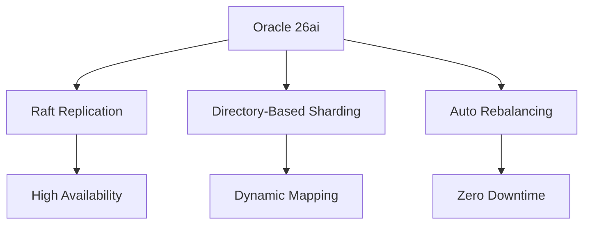
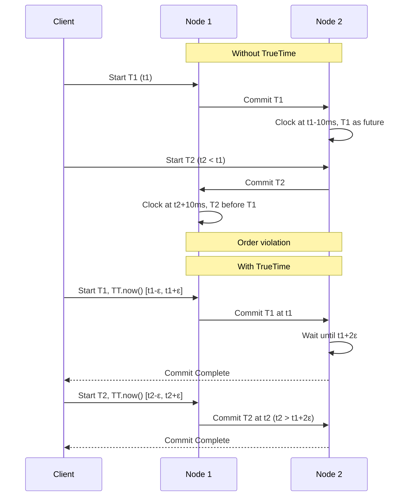
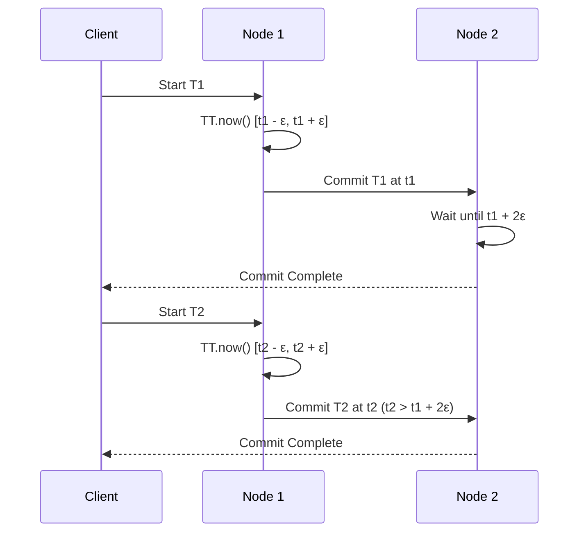
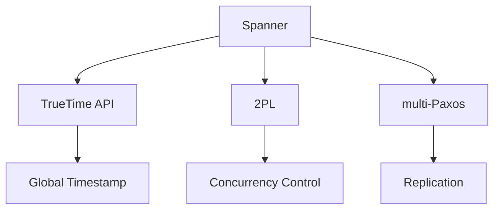

# Oracle AI DB 26aiとSpannerで探る！RDBMSの進化と未来

皆さんは、データベースの進化がどこまで進んでいるか、気になったことはありませんか？ RDBMS（リレーショナルデータベース）は、SQLとACIDで長年エンタープライズを支えてきましたが、クラウドやAIの時代では、もっとスケールする仕組みが必要ですよね。そこで登場するのがNewSQL！ Oracle AI Database 26aiやGoogle Cloud Spannerは、RDBMSの良さを残しつつ、分散処理を取り入れて進化しています。この記事では、両者の技術を初心者にも分かりやすく解説し、RDBMSがNewSQLにどう近づいているかを探ります。さらに、Apache IcebergやAutoMLの最新トレンドも紹介します！

## はじめに

RDBMSは、SQLでデータを整理し、ACID（Atomicity, Consistency, Isolation, Durability）で信頼性を保証します。昔は1台のサーバーで頑張って処理していましたが、クラウド時代ではデータ量やグローバルなアクセスが増え、限界が来ています。NewSQLは、RDBMSのSQLやACIDをキープしつつ、NoSQLのスケーラビリティ（データを複数サーバーに分散）を融合したものです。たとえば、Google Cloud Spannerは世界中でデータを低遅延で処理し、CockroachDBはマルチクラウドを意識しています[^1][^2]。

最近、AIのワークロード（大量データのトレーニングや推論）が急増し、1台のサーバーでは追いつきません。分散システムなら、データを分割して並行処理できるので、速くてコストも抑えられます[^14][^15]。この記事では、Oracle 26aiとSpannerの仕組みをコードや図で分かりやすく解説し、MySQLやPostgreSQLの動向も見ながら、RDBMSの未来を考えます。

## 分散データベースの基本を押さえよう

クラウド時代では、データ量やアクセス需要に対応するため、分散データベースが注目されています。まずは、シャーディングや同期の基本を知っておくと、Oracle 26aiやSpannerのすごさが分かりますよ！

### シャーディングって何？
シャーディングは、データを複数のサーバー（シャード）に分けて保存する仕組みです。たとえば、顧客データが膨大になると1台のサーバーでは遅くなるので、地域やIDで分けて並行処理します。これでスケーラビリティと負荷分散が実現！ OracleやSpannerは、データをキー値で分割する水平シャーディングを使っています。

### 2相コミット（2PC）とは
2PCは、分散システムでトランザクションを同期する手法です。2つのステップで動きます：
- **準備フェーズ**：各サーバーに「コミットできる？」と確認。全員OKなら次へ
- **コミットフェーズ**：全員OKならコミット、1つでもNGならロールバック
信頼性は高いですが、通信が多いので遅延が発生。1台でも障害があると止まるリスクもあります。

### 分散同期のキホン
分散システムでは、データの同期が超重要。代表的な手法は2つ：
- **Raft**：リーダーを選んでデータをコピー。シンプルで運用しやすいです[^5]
- **Paxos**：過半数のサーバーが同意することで一貫性と耐障害性を確保。Spannerで使われています[^1]

:::note info
**Paxosって？**：過半数のサーバーが合意することで、データの一貫性と耐障害性を保つ仕組み。Spannerでは、Tablet（データの分割単位）のレプリカをmulti-Paxosで同期します[^1]
:::

これらの技術が、Oracle 26aiやSpannerの基盤になっています。

## Oracle AI Database 26aiの進化ポイント

Oracle 23aiでは、シャーディングが静的で手動管理が必要でした。26ai（2025年10月リリース、LTS版）では、動的マッピングや自動スケーリングが追加され、運用がラクに！ 私が試した限り、設定の手間が減って感動しました[^3][^4]。主な進化ポイントを見てみましょう。

### 26aiの強化点
- **Raftレプリケーション**：23aiのPaxosからRaftに移行。シンプルで効率的な同期で、データ損失なしの自動フェイルオーバー。99.999%の可用性は頼もしい！[^5]
- **Directory-Based分布**：静的シャーディングから進化。`DBMS_SHARDING_DIRECTORY`でシャードキーをリアルタイム管理。初期設定は必要ですが、後は自動で楽ちんです[^6]
- **自動再バランス**：手動だったシャード再分配が、`DBMS_AUTO_CLUSTERING`で自動化。ダウンタイムなしでスケール！[^4]
- **AI機能の強化**：23aiの検索から進化し、AI Vector Searchをシャーディングと統合。金融分析やeコマースの推奨がサクサクできます[^7]

### なぜRaftにしたの？
Paxosは信頼性が高いけど、複雑でデバッグが大変。Raftはリーダーやフォロワーの役割が明確で、運用が簡単！ HashiCorpのConsulやNomad、Kubernetesのetcdでも使われていますが、SpannerはPaxosを採用しているので注意です[^16][^25][^26]。Oracleは、保守性と開発スピードを重視したみたいですね。

### どんなシーンで使える？
- **グローバルERP**：金融システムで、複数地域のデータを効率処理
- **AI分析**：ベクター検索でリアルタイム顧客分析（例：eコマースの推奨）

*図1 Oracle 26aiのシャーディングアーキテクチャ*

## Google Cloud Spannerのスゴさ

:::note warn
Spannerの内部（TrueTime、Paxos、Tablet）は2012年の論文ベースです。最新情報は公式ドキュメントで確認してくださいね[^4]
:::

Spannerは、Google CloudのNewSQLデータベースで、グローバル分散とACID、外部整合性が特徴。グローバルなのに低遅延って、驚きですよね！

### 外部整合性って何？

外部整合性（linearizability）は、トランザクションが実際の時間順に実行されることを保証します。たとえば、ニューヨークと東京で同時に入金しても、順序が乱れません。SpannerはTrueTimeとPaxosでこれを実現しています[^5]。

### グローバル分散とACIDの両立
グローバル分散でACIDを保つのは難しいんです。サーバーの時計がズレると、トランザクションの順序が乱れるリスクが！ 2PCだと通信遅延でレイテンシが増えます。SpannerはTrueTime API（GPSと原子時計で時刻同期、不確実性ε=平均7ms）を使い、コミット待機（2ε）で順序を保証。低遅延（推定50-100ms）で外部整合性を実現しますが、Google Cloudの専用インフラ依存です[^5]。

*図4 TrueTimeで順序を保証*

## Spannerの設計思想

- **グローバル分散**：複数地域で低遅延（推定50-100ms）。Google Cloudのインフラをフル活用
- **TrueTime API**：時刻tと不確実性[t - ε, t + ε]を提供。コミット待機で順序を保証5
- **自動シャーディング**：データをTablet（キー範囲の分割単位）に分け、Paxosでレプリケーション（3-5レプリカ）。SpannerはPaxosを採用しています[^5][^4][^6][^7]

:::note info
**Tabletって？**：Spannerのデータ分割単位。キー範囲で分割し、Paxosで同期。負荷に応じて自動再配置します[^4]
:::

### どんなシーンで使える？

- **グローバルSaaS**：Google Adsのリアルタイム配信
- **金融**：複数地域の送金で一貫性を確保

*図2 TrueTimeのトランザクション*

*図3 Spannerの外部整合性アーキテクチャ*

## Oracle 26aiとSpannerを比べてみよう

RDBMSとNewSQLの境界が曖昧になる中、Oracle 26aiとSpannerはどう違う？ 共通点と違いを整理してみました。

### 共通点

- **シャーディング**：OracleはDirectory-Basedで動的管理、SpannerはTabletで自動分割。どちらもスケールアウトOK[^8][^4]
- **分散同期**：OracleはRaft、SpannerはPaxosとTrueTimeで同期[^9][^5]
- **AI機能**：OracleはAI Vector Search、SpannerはBigQuery/Vertex AIと統合。AI分析が得意です[^10][^4]

### 違い

- **設計思想**：Oracleはエンタープライズ向け（PL/SQL、ハイブリッド運用）、Spannerはクラウドネイティブ（TrueTime依存）[^5][^8]
- **一貫性**：Spannerは外部整合性、Oracleはシリアル一貫性[^5][^9]
- **パフォーマンス**：Spannerはグローバルで50-100ms（推定）、Oracleはリージョン内で100-200ms（推定）[^5][^8]

### どんなシーンで使う？

|システム|用途|例|
|:--|:--|:--|
|Oracle 26ai|グローバルERP、AI分析|金融の分散トランザクション、eコマース推奨|
|Spanner|グローバルSaaS、金融|Google Ads、リアルタイム送金|

## MySQLとPostgreSQLのNewSQL化

MySQLやPostgreSQLも分散機能を強化し、NewSQLに近づいています。どんな進化があるか見てみましょう。

### MySQLの分散対応

- **HeatWave**：自動シャーディングとスケールアウト（AWS/Google Cloud/OCI）。Vector StoreでAIも対応[^11][^12]
- **Group Replication**：半同期で高可用性。リージョン内のスケーラビリティに強い
- **用途**：eコマースの注文データ分散
- **課題**：Spannerに比べグローバル一貫性が弱く、レイテンシは高め（推定200ms）[^11]

### PostgreSQLの分散対応

- **Citus**：分散クエリとシャーディング。pgvectorでベクター検索をサポート[^13][^14]
- **クラウド版**：AWS AuroraやAzure Cosmos DBで自動スケーリング
- **用途**：IoTデータのリアルタイム集計
- **課題**：2PCのオーバーヘッドが大きい[^13]

### NewSQLとのギャップ

CockroachDBはRaftで分散一貫性、TiDBはPaxosを採用。MySQLやPostgreSQLは進化していますが、Spannerの外部整合性や自動シャーディングにはまだ追いついていません。コミュニティ駆動だと開発速度が遅いのも課題です（MySQL 8.5は2026年予定、PostgreSQL 18.0は2025年予定）[^15][^16][^17][^18][^19]。

## これからのRDBMS：IcebergとAutoMLが熱い！

クラウドやAIの進化で、RDBMSはNewSQLのいいとこ取りを始めています。最後に、注目のApache IcebergとAutoMLを紹介します。

### Apache Icebergって？

Apache Icebergは、データレイクをSQLテーブルみたいに扱えるオープンソースのテーブルフォーマットです。特徴は：

- **ACIDトランザクション**：データの一貫性を保証
- **スキーマ進化**：列の追加や変更が簡単
- **タイムトラベル**：過去のデータを復元
OracleはIcebergをLakehouse対応で採用。S3などのオブジェクトストレージでデータベース並みの信頼性を確保し、ETLの複雑さを減らします。データ湖の管理がラクになるので、試してみる価値あり！[^20][^21]

### AutoMLって？

MySQL HeatWaveのAutoMLは、モデル構築やトレーニングを自動化する機能です。AIの専門知識がなくても、異常検知や予測をデータベース内でサクッと実行。HeatWaveクラスタの並列処理で25倍高速化、データドリフト検知でモデルも自動更新。Jupyterでビジネスアナリストも使いやすいです[^22][^23]。

### RDBMSの未来

Oracle 26aiはRaftやIcebergで、SpannerはTrueTimeで進化していますが、MySQLやPostgreSQLも負けていません。HeatWaveやCitusでAIや分散処理を取り入れ、ハイブリッドDBとして進化中です。でも、Spannerのグローバル一貫性はTrueTime頼みで再現が難しい。用途に応じて、RDBMSとNewSQLのいいとこ取りを選ぶのが現実的だと感じます。

## 最後に

RDBMSの進化は止まりません！ Oracle 26aiやSpannerは、分散処理やAIで未来を切り開いています。MySQLやPostgreSQLも頑張っていますが、グローバルな一貫性ではまだ課題が。皆さんのシステムに合うDBを選ぶヒントになれば嬉しいです！

:::note info
宣伝：私が関わる株式会社ブレインパッドでは、生成AIを活用した「Rtoaster GenAI」を提供中。CX・EXを向上させる検索SaaSです。興味があればぜひチェックしてください！[^24]
:::

## 脚注
*注：パフォーマンスデータは推定値です。詳細は公式ドキュメントで確認してください*
